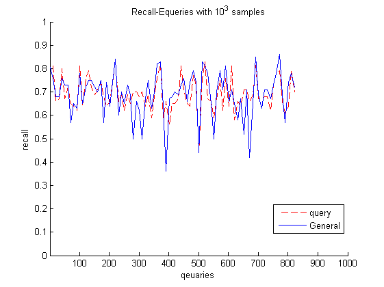
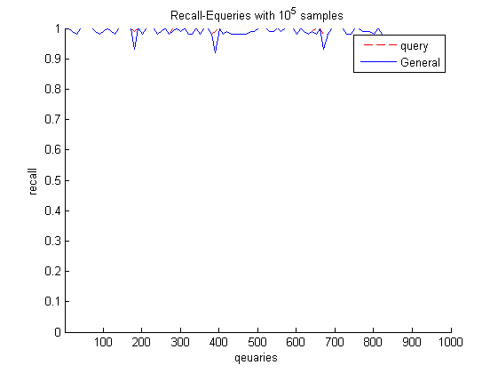
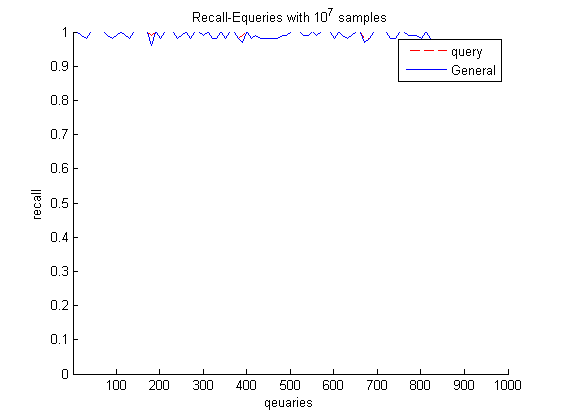
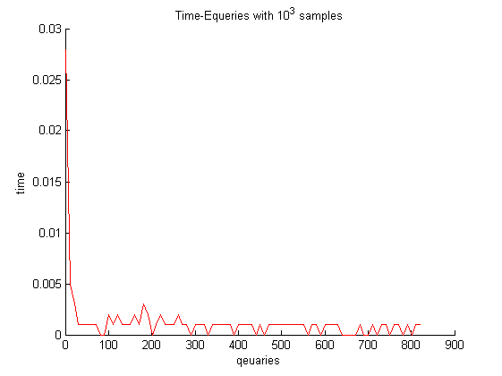
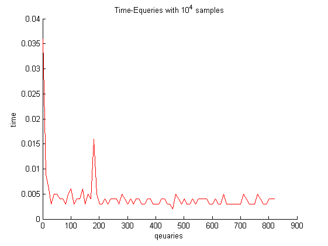
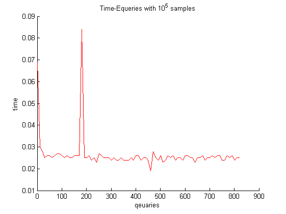
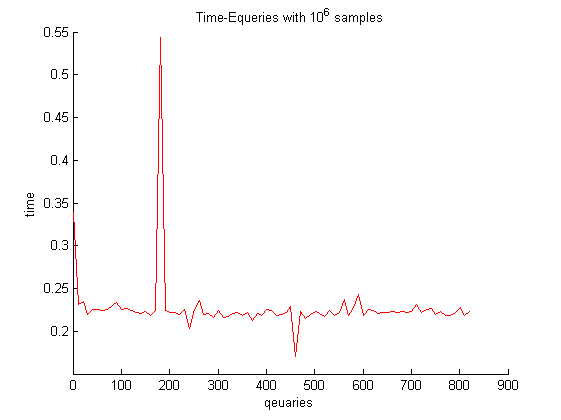
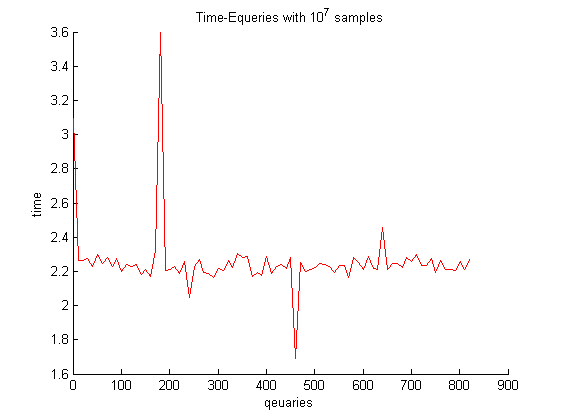

### result of query sampling

The user matrix's size 1000x200

The other two matrices' size: 18744x200 , 12647x200

#### Find the top 100 largest value of each query

samples __[10^3,...,10^7]__

 comparison of recall between tow methods.

#### time for each query of general diamond sampling 
>0.037 for general 0.073,,3.619]

>0.040

>0.073 for general

>0.5111 for general

>3.619 for general

